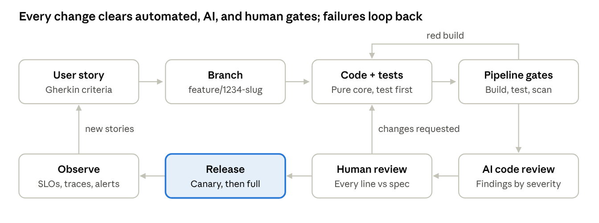

# Mission-Critical Microservices with Claude Code

By Michael Griffey · September 27, 2026

*Companion code: this repository. The [README](../README.md) maps each section to the files that implement it.*

## Correctness is the feature

Claude Code can take a microservice from a one-line idea to a released production service, but only if you point it at correctness instead of speed. Most AI coding content optimizes for how fast code appears. For systems classified as safety-critical, mission-critical, or high-availability, that is the wrong metric. These systems must prioritize predictability, fault tolerance, and absolute correctness over feature velocity.

This post walks the full lifecycle the way I run it: a question-first protocol so Claude asks instead of guessing, user stories with real acceptance criteria, a design built on pure functions, skills and enterprise guardrails, disciplined branching, layered test batteries, Azure DevOps pipelines versioned in GitHub, actionable AI code reviews, and a human reading every line before anything ships. The example stack is .NET 10, but the workflow is language agnostic. Every C# sample compiles with nullable reference types, the recommended analyzers, and warnings treated as errors.

The core principle is simple. Claude is a force multiplier for rigor, not a replacement for it. Every artifact Claude produces is a draft that must be verified against a specification, by tests and by human eyes.

The lifecycle below is a loop, not a line. Any gate that fails sends the work back to the step that owns the defect.



A red build or a requested change returns work to the author; production telemetry becomes the next set of stories.

## 1. Teach Claude to ask before it assumes

The most expensive defect an AI assistant produces is a confident guess. When behavior or architecture is not evident from the story, the code, or a decision record, Claude fills the gap with the most plausible option: retry forever, treat timestamps as local time, drop the malformed message. In a mission-critical system, a plausible default is an unreviewed requirement. So make asking the default, and make it cheap to answer.

Claude Code already has the mechanics. In plan mode (`claude --permission-mode plan`, or Shift+Tab during a session), Claude reads the codebase and cannot edit files until you approve a plan. When it needs direction, it uses the `AskUserQuestion` tool: one to four multiple-choice questions, two to four options each, with room for a free-text answer. What it lacks by default is your threshold for when a guess is unacceptable. Write that threshold into `CLAUDE.md`:

```markdown
## When to stop and ask (never guess)
Ask before writing code when any of these is not stated in the story, an ADR, or existing code:
- Behavior on invalid, missing, duplicate, late, or out-of-order input
- Failure semantics: retry, give up, dead-letter, compensate, or fail closed
- Consistency, ordering, and idempotency guarantees
- Units, time zones, precision, rounding, and numeric limits
- Security: who may call this, what is logged, which data classification applies
- Architecture: a new dependency, project, layer, or pattern, or any change to a public contract
- Two or more reasonable designs with different trade-offs

How to ask:
- Ask all blocking questions at once, as multiple choice, recommended option first with its trade-off.
- Cite the evidence that made it ambiguous (file:line, story, ADR).
- Do not proceed past a blocking question. List non-blocking assumptions in the PR under "Assumptions".
- When answered, record it: behavior becomes an acceptance criterion in the story; design becomes an ADR in docs/adr/.
```

A good question names the gap, the options, and the cost of each. Compare "How should errors be handled?" with this:

```text
The event store can time out after the reading row is written
(IReadingStore has no transactional contract; Features/Ingest/IngestEndpoint.cs).
How should ingestion behave?
  A. Write reading and event in one transaction via an outbox; return 503 on
     failure and rely on idempotent client retry  (recommended: no partial state)
  B. Return 202 and reconcile asynchronously  (simpler client, eventual consistency)
  C. Distributed transaction across both stores  (strong consistency, new infrastructure)
```

That single answer became AC-4 in the next section and shaped the `IReadingStore` contract in section 6.

Three practices keep the protocol honest:

- **Start ambiguous work in plan mode.** Tell Claude to list every assumption it would need to make, ask about each one that affects behavior or architecture, and only then write the plan.
- **Keep questions in the main session.** `AskUserQuestion` is not available to subagents, so a subagent that hits ambiguity should stop and return its questions rather than pick an answer.
- **Close the loop in artifacts, not chat.** An answer that lives only in a conversation is lost at the next session. Recorded in the story or an ADR, it becomes something tests prove and reviewers check. `CLAUDE.md` is guidance that Claude usually follows, not an enforced control; the enforcement is the review rule in section 10 that any behavior without a criterion is a finding.

## 2. Planning: user stories with depth

A vague story produces vague code, and no amount of testing fixes a missing requirement. Claude is excellent at interrogating a feature idea until the edge cases fall out, provided you ask it to challenge you rather than agree with you.

Start every feature in Claude Code's plan mode, which lets Claude read the codebase and reason without editing files. A prompt that works well:

```text
Act as a senior business analyst for a mission-critical telemetry platform.
Draft a user story for: "Ingest sensor readings and flag out-of-range values."
Before writing it, list every ambiguity, boundary condition, failure mode,
and non-functional requirement you can find. Ask me to resolve each one.
Then produce: INVEST-compliant story, Gherkin acceptance criteria covering
happy path, boundaries, invalid input, and dependency failure, plus
non-functional criteria with measurable thresholds.
```

The questions Claude returns are the real value. Typical ones: What happens when a reading is exactly on the threshold? Are readings idempotent by sensor and timestamp? What is the behavior when the downstream store is unavailable? Is NaN a reading or an error? Each answer becomes a criterion.

The resulting story reads like this. Each criterion carries a tag (`@AC-1` through `@AC-5`) that tests, code comments, and review findings cite, which makes traceability searchable:

```gherkin
Feature: Out-of-range sensor reading detection
  As a flight operations engineer
  I want every sensor reading classified against its calibrated limits
  So that anomalies are surfaced before they affect mission decisions

  Background:
    Given sensor "TMP-07" has limits -40.0 to 125.0 degrees C
    And readings may be at most 5 minutes old and 2 seconds ahead of server time

  @AC-1
  Scenario Outline: Limits are inclusive
    When a reading of <value> is received
    Then the reading is classified "<classification>"

    Examples:
      | value      | classification |
      | -40.0      | Nominal        |
      | 125.0      | Nominal        |
      | -40.000001 | Low            |
      | 125.000001 | High           |

  @AC-2
  Scenario: Non-finite reading is rejected, not classified
    When a reading of NaN is received
    Then the reading is rejected with error "NonFiniteValue"
    And no classification event is published

  @AC-3
  Scenario: Duplicate reading is idempotent
    Given a reading for "TMP-07" was accepted
    When a reading with the same sensor and timestamp arrives again
    Then no second event is published

  @AC-4
  Scenario: Event store is unavailable
    Given the event store is not reachable
    When a valid reading is received
    Then the API returns 503 with a Retry-After header
    And the reading is not partially persisted

  @AC-5
  Scenario Outline: Readings outside the freshness window are rejected
    When a reading observed <offset> is received
    Then the reading is rejected with error "<error>"

    Examples:
      | offset                  | error           |
      | 5 minutes 1 second ago  | StaleReading    |
      | 3 seconds in the future | FutureTimestamp |
```

Non-functional criteria belong in the story too, stated as numbers: p99 latency under 50 ms at 2,000 requests per second, zero data loss on pod termination, and graceful degradation when a dependency fails.

Claude can then push the story into Azure Boards so the work item and the spec never drift. One detail matters: `az boards work-item create` has no Markdown option yet, and the Description field defaults to HTML, so raw Markdown passed to `--description` arrives as an unformatted wall of text. Create the item with the CLI, then set the fields as Markdown through the REST API's `multilineFieldsFormat` operation:

```bash
# 1. Create the work item and capture its id
id=$(az boards work-item create --org https://dev.azure.com/contoso --project Telemetry \
  --type "User Story" --title "Out-of-range sensor reading detection" \
  --area "Telemetry\Ingestion" --query id -o tsv)

# 2. Story as Markdown description; Gherkin as an indented code block in Acceptance Criteria
jq -n --rawfile story docs/stories/1234-sensor-range.md \
      --rawfile ac docs/stories/1234-sensor-range.feature '[
  {op: "add", path: "/fields/System.Description", value: $story},
  {op: "add", path: "/multilineFieldsFormat/System.Description", value: "Markdown"},
  {op: "add", path: "/fields/Microsoft.VSTS.Common.AcceptanceCriteria",
   value: ($ac | split("\n") | map("    " + .) | join("\n"))},
  {op: "add", path: "/multilineFieldsFormat/Microsoft.VSTS.Common.AcceptanceCriteria", value: "Markdown"}
]' > patch.json

# 3. Apply it (499b84ac-... is the Azure DevOps resource id for az rest tokens)
az rest --method patch \
  --uri "https://dev.azure.com/contoso/Telemetry/_apis/wit/workitems/$id?api-version=7.1" \
  --resource 499b84ac-1321-427f-aa17-267ca6975798 \
  --headers "Content-Type=application/json-patch+json" --body @patch.json
```

Saving a field as Markdown is one-way; Azure DevOps cannot convert it back to HTML, so decide on the format once per project.

Commit the Gherkin file to the repository alongside the code. It becomes the executable specification for the end-to-end suite in section 7.

## 3. Design: a functional core behind an imperative shell

Determinism is a design decision, not a testing afterthought. The architecture that makes a service provably correct separates two kinds of code:

- **Functional core:** pure functions. Same input, same output, no I/O, no clock, no randomness, no shared mutable state. All business rules live here.
- **Imperative shell:** a thin layer that reads from the world (HTTP, database, clock, message bus), calls the core, and writes the result back. It contains no decisions worth testing in isolation.

Combine that with Vertical Slice Architecture and CQRS: each feature is a folder containing its command or query, handler, validator, pure domain logic, and tests. A reviewer can see the entire behavior of a feature without jumping across layers, and Claude can work on one slice with full context and minimal blast radius.

Ask Claude for an Architecture Decision Record before any code exists. Have it enumerate failure modes for every external dependency (timeouts, partial writes, duplicates, out-of-order delivery) and the chosen mitigation for each: retries with jittered backoff, idempotency keys, the outbox pattern, circuit breakers, and bulkheads.

Then encode the rules where Claude will read them every session. `CLAUDE.md` at the repo root is loaded automatically, so it becomes your engineering standard, alongside the stop-and-ask protocol from section 1:

```markdown
# Engineering rules (non-negotiable)
- Domain logic is pure: no DateTime.Now, Guid.NewGuid, Random, I/O, or statics.
  Inject TimeProvider and ID generators at the shell.
- No exceptions for expected failures. Return Result<T, TError>.
- Validate at the boundary; the core only receives validated types.
  Check null, empty, NaN, Infinity, min/max values, and out-of-range enums.
- Every acceptance criterion (AC-n) maps to at least one named test.
- Never modify, skip, or delete an acceptance test without explicit approval.
- Nullable reference types enabled; warnings are errors.
- Never commit to main. One branch per work item: feature/<id>-<slug>.
- Commits follow Conventional Commits and reference the work item (AB#<id>).
- Do not mark a task done until `dotnet test` passes locally.
```

Claude follows these rules far more consistently when they are written down than when they are repeated in prompts. Treat `CLAUDE.md` as code: it is reviewed, versioned, and improved every time Claude makes a mistake the rules should have prevented.

## 4. Skills and enterprise guardrails

Instructions tell Claude what you want; guardrails decide what can happen anyway. Claude Code's own documentation is explicit that `CLAUDE.md` is context, not enforced configuration. Enterprise delivery needs three further layers: skills that package repeatable procedures, rules that load standards exactly where they apply, and settings that hold even when a model or a developer gets it wrong.

### Skills: package the procedure once

A skill is a folder, `.claude/skills/<name>/SKILL.md`, with YAML frontmatter and instructions. Claude loads it automatically when a request matches its `description`, or you run it as `/name`. Supporting files in the folder load only when needed, so a skill can carry templates and checklists without bloating every session. Commit project skills to the repository and they become the team's shared playbook.

| Skill | What it does | Invocation |
| --- | --- | --- |
| `start-story` | Reads the story, creates the branch, runs the question protocol from section 1 | Manual only |
| `new-slice` | Scaffolds a vertical slice and failing acceptance tests | Manual only |
| `write-adr` | Turns an answered design question into a numbered decision record | Manual or automatic |
| `secure-endpoint` | Checks a slice against the API security rules below | Automatic on endpoint work |
| `repro-incident` | Turns an alert and its trace into a failing test | Manual only |
| `release-notes` | Builds notes from Conventional Commits and linked work items | Manual only |

Three frontmatter fields do most of the governance. `disable-model-invocation: true` means only a person can start the skill, which is right for anything with side effects. `allowed-tools` pre-approves only what the skill needs; everything else still goes through normal permission prompts. `arguments` gives inputs names:

```markdown
---
name: new-slice
description: Scaffolds a vertical slice (pure core, thin endpoint, failing acceptance tests) that follows our engineering rules. Use when starting a new feature endpoint from a user story.
argument-hint: <work-item-id> <FeatureName>
arguments: [id, feature]
disable-model-invocation: true
allowed-tools: Read, Grep, Glob, Bash(git branch *), Bash(dotnet build *), Bash(dotnet test *)
---
# New vertical slice for AB#$id: $feature

Current branch: !`git branch --show-current`

1. Read the story for work item $id in docs/stories/. If it has no tagged
   acceptance criteria (@AC-n), stop and ask for them. Apply the
   "When to stop and ask" rules in CLAUDE.md.
2. Create src/Ingestion.Api/Features/$feature/ following [slice-template.md](slice-template.md):
   - a pure core: static functions returning Result<T, TError>; no I/O, no clock
   - a thin endpoint that gathers inputs, calls the core, and maps every error to a status
3. Create tests/Ingestion.UnitTests/$feature/ with one named test per criterion,
   written first. They must fail for the right reason.
4. Run `dotnet build` and `dotnet test`, then report each failing test and why.

Stop there. Implementation starts after a human reviews the failing tests.
```

Running `/new-slice 1234 IngestReadings` fills in the names, injects the current branch before Claude reads the file (the `!` line runs first), and ends at a human checkpoint by design. Treat skills like code: they are reviewed, versioned, and fixed whenever Claude does something the procedure should have prevented. To share them across many repositories, publish them as a plugin in an internal marketplace.

### Rules: standards that load where they apply

Enterprise applications carry the same non-functional requirements in every service: authorization, logging hygiene, input bounds, error contracts, resilience, audit, and supply chain. Put them in `.claude/rules/`, and use `paths` so a rule loads only when Claude works on matching files:

```markdown
---
paths:
  - "src/**/Features/**/*.cs"
---
# API security and compliance rules
- Every endpoint requires authorization through a named policy. No anonymous
  endpoint without an ADR.
- Never log request bodies, tokens, or fields classified PII or CUI. Log IDs, not values.
- Validate and bound all input at the boundary: sizes, ranges, formats, enums.
- Errors are RFC 9457 problem details. Never return exception messages or stack traces.
- Outbound calls have explicit timeouts, jittered retries, and a circuit breaker.
- Every state change emits an audit event: who, what, when, correlation ID.
- New packages need an approved license and a clean vulnerability audit.
```

The endpoint in section 6 follows these rules, and the reviewer in section 9 checks them. A rule that nobody verifies is a wish.

### Repository guardrails

Each repository enforces three layers, strongest first:

- **GitHub branch protection** (or a ruleset) on `main`: required PR, required reviewers, required Azure Pipelines status checks, linear history, no force pushes. This is the layer no agent can talk its way around, so it is the one that counts.
- **Claude Code permissions** in the committed `.claude/settings.json`: allow the build, test, and local git commands, ask before every push, and deny force pushes and hard resets. Rules that constrain Bash arguments are best effort; Claude Code's own documentation notes that `git -C . push origin main` does not match `Bash(git push *)`. That is why branch protection sits underneath.
- **A `PreToolUse` hook** that fires only on `git commit`. Exit code 2 blocks the tool call and returns the hook's stderr to Claude as the reason, so an unformatted or failing change never becomes a commit.

```json
{
  "permissions": {
    "allow": ["Bash(dotnet build *)", "Bash(dotnet test *)", "Bash(dotnet format *)",
              "Bash(git status)", "Bash(git diff *)", "Bash(git add *)", "Bash(git commit *)",
              "Bash(git switch *)", "Bash(git rebase *)"],
    "ask":   ["Bash(git push *)", "Bash(gh pr create *)"],
    "deny":  ["Bash(git push --force *)", "Bash(git push -f *)", "Bash(git reset --hard *)"]
  },
  "hooks": {
    "PreToolUse": [
      {
        "matcher": "Bash",
        "hooks": [
          {
            "type": "command",
            "if": "Bash(git commit *)",
            "command": "${CLAUDE_PROJECT_DIR}/.claude/hooks/verify-before-commit.sh"
          }
        ]
      }
    ]
  }
}
```

```bash
#!/usr/bin/env bash
# PreToolUse hook: runs only for `git commit` (see "if" in settings.json).
# Exit 2 blocks the commit and returns stderr to Claude as the reason.
set -uo pipefail
cd "${CLAUDE_PROJECT_DIR:?}" || exit 2

if ! dotnet format --verify-no-changes >&2; then
  echo "Commit blocked: formatting drift. Run 'dotnet format' and retry." >&2
  exit 2
fi
if ! dotnet test tests/Ingestion.UnitTests --nologo >&2; then
  echo "Commit blocked: unit tests fail. Fix the code, not the tests." >&2
  exit 2
fi
exit 0
```

### Organization guardrails

Repository settings can be edited by anyone with commit access. Controls that must hold across every repository and every developer belong in managed settings, which Claude Code applies above user and project settings. Deploy them from the Claude admin console (server-managed), through MDM, or as a file: `/etc/claude-code/managed-settings.json` on Linux and WSL, `/Library/Application Support/ClaudeCode/managed-settings.json` on macOS, and `C:\Program Files\ClaudeCode\managed-settings.json` on Windows.

```json
{
  "permissions": {
    "defaultMode": "default",
    "disableAutoMode": "disable",
    "disableBypassPermissionsMode": "disable",
    "deny": [
      "Read(./.env)",
      "Read(./.env.*)",
      "Read(./secrets/**)",
      "Bash(git push --force *)",
      "Bash(git push -f *)"
    ]
  },
  "allowManagedMcpServersOnly": true,
  "allowedMcpServers": [
    { "serverUrl": "https://mcp.contoso.internal/azure-devops/*" }
  ],
  "strictKnownMarketplaces": [
    { "source": "github", "repo": "contoso/claude-plugins" }
  ],
  "sandbox": {
    "enabled": true,
    "failIfUnavailable": true,
    "allowUnsandboxedCommands": false,
    "network": {
      "allowedDomains": ["api.nuget.org", "github.com", "dev.azure.com"],
      "allowManagedDomainsOnly": true
    }
  },
  "env": {
    "CLAUDE_CODE_ENABLE_TELEMETRY": "1",
    "OTEL_LOGS_EXPORTER": "otlp",
    "OTEL_METRICS_EXPORTER": "otlp",
    "OTEL_EXPORTER_OTLP_PROTOCOL": "grpc",
    "OTEL_EXPORTER_OTLP_ENDPOINT": "https://otel.contoso.internal:4317"
  },
  "cleanupPeriodDays": 7
}
```

What each block buys:

- **Human in the loop by default.** Sessions start in Manual mode, where Claude asks before edits and commands. Auto mode and bypass mode are removed, so no one can switch the reviewer off.
- **Secrets stay unread.** Deny rules for `.env` files and the secrets folder merge into every project's list and cannot be removed by a lower level.
- **Egress is closed at the OS.** A deny rule on `curl` only matches the command as written; the sandbox's network allowlist enforces egress for every command Claude runs, and `failIfUnavailable` refuses to start without it.
- **Only approved integrations.** MCP servers and plugin marketplaces are allowlisted, so a skill or tool cannot arrive from an unvetted source.
- **Every action is auditable.** OpenTelemetry export records prompts, tool decisions, and tool results with correlation IDs, which feeds the same observability stack as the service itself. These variables are ignored in a repository's settings, so they must come from managed or user settings.

Two stricter locks exist, and both have a trade-off worth deciding on purpose. `allowManagedPermissionRulesOnly` ignores permission rules from project settings, so the allow and ask lists above must move into managed policy. `allowManagedHooksOnly` does the same for hooks, so the commit gate must ship as managed configuration or a plugin. Organization-wide standards that belong in every session, such as the stop-and-ask protocol, can go in the managed `CLAUDE.md` at the same system paths.

Finally, confirm data handling before any code reaches a model. Anthropic does not train on code or prompts from Team, Enterprise, API, or cloud-provider plans, and zero data retention is available to qualifying Enterprise accounts. For export-controlled or CUI work, verify that the provider, region, and retention settings satisfy the contract's clauses first.

## 5. Branches and check-ins

Claude Code runs `git` and the GitHub CLI (`gh`) directly, so it can own the mechanics of source control while you own the decisions. The goal is a history that tells the story of every change and a `main` branch that is always releasable.

The workflow Claude follows for each work item:

1. Pull `main` and create `feature/1234-sensor-range` from it.
2. Commit in small, atomic steps: failing test first, then the implementation that makes it pass, then any refactor. Each commit builds and passes tests on its own.
3. Write Conventional Commit messages that reference the Azure Boards item, for example `feat(ingestion): classify readings at inclusive limits AB#1234`. The `AB#` syntax links the commit to the work item automatically once the Azure Boards app is connected to the GitHub repository.
4. Rebase on `main` before the first push, so reviewers see a clean diff and no one force-pushes a shared branch.
5. Open the PR with `gh pr create`, filling a template that lists each acceptance criterion and the test that proves it.

The branch protection, permission rules, and commit hook in section 4 enforce this routine, and the `start-story` skill runs it with one command.

## 6. Code that is functionally complete

Functionally complete code handles every input it can receive, not just the ones in the demo. Left alone, any code generator (human or AI) writes the happy path first. The fix is to make outliers an explicit deliverable. Before implementation, ask Claude to enumerate the input space for the function and return it as a checklist:

| Category | Outliers Claude must handle and test |
| --- | --- |
| Numeric | NaN, positive and negative infinity, -0.0, MinValue, MaxValue, values exactly on a boundary, floating-point precision near limits |
| Strings | null, empty, whitespace, max length plus one, non-ASCII and combining characters, injection payloads |
| Collections | empty, single element, duplicates, very large inputs, unsorted when sorted is assumed |
| Time | UTC versus local, DST transitions, clock skew, future timestamps, stale data |
| Delivery | duplicate messages, out-of-order arrival, partial batches, replays |
| Dependencies | timeout, slow response, connection refused, partial write, malformed response |

Then require the pure core to express every one of those outcomes in its types. Start with a small `Result` type so the compiler forces every caller to handle failure. A library such as OneOf or ErrorOr works as well; the principle matters more than the package:

```csharp
using System.Diagnostics.CodeAnalysis;

namespace Ingestion.Domain;

/// <summary>Success or an expected failure, as a value. Callers must handle both.</summary>
public sealed class Result<T, TError>
    where T : notnull
    where TError : notnull
{
    private readonly T? _value;
    private readonly TError? _error;

    private Result(T value) => (_value, IsSuccess) = (value, true);
    private Result(TError error) => _error = error;

    public bool IsSuccess { get; }
    public bool IsError => !IsSuccess;

    public bool TryGetValue([NotNullWhen(true)] out T? value, [NotNullWhen(false)] out TError? error)
    {
        (value, error) = (_value, _error);
        return IsSuccess;
    }

    public TResult Match<TResult>(Func<T, TResult> onSuccess, Func<TError, TResult> onError)
    {
        ArgumentNullException.ThrowIfNull(onSuccess);
        ArgumentNullException.ThrowIfNull(onError);
        return IsSuccess ? onSuccess(_value!) : onError(_error!);
    }

    public static implicit operator Result<T, TError>(T value) => new(value);
    public static implicit operator Result<T, TError>(TError error) => new(error);
}
```

Next come the validated types and the classifier for the story in section 2. `Limits` and `FreshnessPolicy` have private constructors and a `Create` factory that returns a `Result`, so an invalid instance cannot exist. Their properties are get-only, which also stops a `with` expression from sneaking past validation.

```csharp
namespace Ingestion.Domain;

public enum Classification { Low, Nominal, High }

public abstract record ReadingError(string Code)
{
    public sealed record NonFiniteValue() : ReadingError("NonFiniteValue");
    public sealed record InvalidLimits(double Lower, double Upper) : ReadingError("InvalidLimits");
    public sealed record InvalidPolicy(TimeSpan MaxAge, TimeSpan MaxSkew) : ReadingError("InvalidPolicy");
    public sealed record FutureTimestamp(TimeSpan Skew) : ReadingError("FutureTimestamp");
    public sealed record StaleReading(TimeSpan Age) : ReadingError("StaleReading");
}

/// <summary>Calibrated limits. The only way to get one is valid: finite and ordered.</summary>
public sealed record Limits
{
    private Limits(double lower, double upper) => (Lower, Upper) = (lower, upper);

    public double Lower { get; }
    public double Upper { get; }

    public static Result<Limits, ReadingError> Create(double lower, double upper) =>
        double.IsFinite(lower) && double.IsFinite(upper) && lower <= upper
            ? new Limits(lower, upper)
            : new ReadingError.InvalidLimits(lower, upper);
}

/// <summary>How old a reading may be, and how far ahead of our clock it may claim to be.</summary>
public sealed record FreshnessPolicy
{
    private FreshnessPolicy(TimeSpan maxAge, TimeSpan maxSkew) => (MaxAge, MaxSkew) = (maxAge, maxSkew);

    public TimeSpan MaxAge { get; }
    public TimeSpan MaxSkew { get; }

    public static Result<FreshnessPolicy, ReadingError> Create(TimeSpan maxAge, TimeSpan maxSkew) =>
        maxAge > TimeSpan.Zero && maxSkew >= TimeSpan.Zero
            ? new FreshnessPolicy(maxAge, maxSkew)
            : new ReadingError.InvalidPolicy(maxAge, maxSkew);
}

public static class RangeClassifier
{
    // Pure: same inputs, same output. No clock, no I/O, no expected-failure exceptions.
    public static Result<Classification, ReadingError> Classify(
        double value, Limits limits, DateTimeOffset observedAt,
        DateTimeOffset now, FreshnessPolicy policy)
    {
        ArgumentNullException.ThrowIfNull(limits);   // a null here is a defect, not an input
        ArgumentNullException.ThrowIfNull(policy);

        if (!double.IsFinite(value))
            return new ReadingError.NonFiniteValue();                  // AC-2

        var age = now - observedAt;
        if (age < -policy.MaxSkew) return new ReadingError.FutureTimestamp(-age);  // AC-5
        if (age > policy.MaxAge) return new ReadingError.StaleReading(age);      // AC-5

        // Limits are inclusive (AC-1).
        return value < limits.Lower ? Classification.Low
             : value > limits.Upper ? Classification.High
             : Classification.Nominal;
    }
}
```

The `IsFinite` guard is the kind of line that separates safe code from plausible code. Without it, NaN fails both comparisons and the reading is silently classified as Nominal. That is a correct-looking bug that no happy-path test will ever catch.

A few rules make this style hold across a whole service:

- **Time is a parameter.** The shell injects .NET's `TimeProvider`; the core receives a plain `DateTimeOffset`. Tests never sleep or depend on the wall clock.
- **Expected failures are values.** `Result<T, TError>` forces every caller to handle every error case. Exceptions are reserved for defects, such as a null argument that nullable analysis should already have prevented.
- **Make illegal states unrepresentable.** Parse raw input into validated types at the boundary, so the core never sees an invalid `Limits` or `FreshnessPolicy`.
- **The shell stays thin.** It reads the clock, calls `Classify`, persists, and maps each `ReadingError` to an HTTP status. It makes no decisions of its own.

Here is that shell, a vertical slice in `Features/Ingest`. Every dependency is explicit, every outcome has a status code, and an error the switch does not map fails loudly instead of silently returning 200:

```csharp
using System.Diagnostics;
using Ingestion.Domain;
using Microsoft.AspNetCore.Http.HttpResults;
using Microsoft.AspNetCore.Mvc;

namespace Ingestion.Api.Features.Ingest;

public sealed record IngestReadingRequest(double Value, DateTimeOffset ObservedAt);
public sealed record IngestReadingResponse(Classification Classification);
public sealed record Sensor(string Id, Limits Limits);
public sealed record ClassifiedReading(
    string SensorId, double Value, DateTimeOffset ObservedAt, Classification Classification);

public interface ISensorRegistry
{
    Task<Sensor?> FindAsync(string sensorId, CancellationToken ct);
}

public interface IReadingStore
{
    /// <summary>Writes the reading and its outbox event in one transaction.
    /// Idempotent on (SensorId, ObservedAt): a duplicate is a no-op.</summary>
    /// <exception cref="StoreUnavailableException">The store cannot be reached.</exception>
    Task AppendAsync(ClassifiedReading reading, CancellationToken ct);
}

public sealed class StoreUnavailableException(string message, Exception innerException)
    : Exception(message, innerException);

public static class IngestEndpoint
{
    public const string WritePolicy = "readings:write";

    public static IEndpointRouteBuilder MapIngestReadings(this IEndpointRouteBuilder app)
    {
        app.MapPost("/sensors/{sensorId}/readings", HandleAsync)
           .RequireAuthorization(WritePolicy);                    // no anonymous writes
        return app;
    }

    // Imperative shell: gather inputs, call the pure core, translate the outcome. No rules here.
    private static async Task<IResult> HandleAsync(
        [FromRoute] string sensorId,
        [FromBody] IngestReadingRequest request,
        [FromServices] ISensorRegistry registry,
        [FromServices] IReadingStore store,
        [FromServices] TimeProvider clock,
        [FromServices] FreshnessPolicy policy,
        HttpResponse response,
        CancellationToken ct)
    {
        var sensor = await registry.FindAsync(sensorId, ct);
        if (sensor is null)
            return TypedResults.NotFound();

        var outcome = RangeClassifier.Classify(
            request.Value, sensor.Limits, request.ObservedAt, clock.GetUtcNow(), policy);

        if (!outcome.TryGetValue(out var classification, out var error))
            return ToProblem(error);

        try
        {
            await store.AppendAsync(
                new ClassifiedReading(sensorId, request.Value, request.ObservedAt, classification), ct);
            return TypedResults.Ok(new IngestReadingResponse(classification));
        }
        catch (StoreUnavailableException)
        {
            response.Headers.RetryAfter = "5";                                        // AC-4
            return TypedResults.Problem(
                statusCode: StatusCodes.Status503ServiceUnavailable, title: "EventStoreUnavailable");
        }
    }

    private static ProblemHttpResult ToProblem(ReadingError error) => error switch
    {
        ReadingError.NonFiniteValue or ReadingError.FutureTimestamp or ReadingError.StaleReading =>
            TypedResults.Problem(statusCode: StatusCodes.Status422UnprocessableEntity, title: error.Code),
        _ => throw new UnreachableException($"Classifier returned unmapped error '{error.Code}'."),
    };
}
```

One outlier lives at the transport layer. JSON has no NaN or Infinity token, so a bare `NaN` is rejected by the serializer with a 400 before any rule runs. ASP.NET Core's web defaults (`AllowReadingFromString`) do accept the quoted strings `"NaN"` and `"-Infinity"`, and those reach the domain and return 422 `NonFiniteValue`, exactly as AC-2 requires. Know which behavior you have, and write the end-to-end test for it. If the contract should also refuse numbers sent as strings, set `NumberHandling` explicitly; assigning it replaces the web default rather than adding to it.

The composition root keeps those defaults, serializes enums by name, fails fast at startup if its own configuration is invalid, and defines the write policy the API rules in section 4 require. A caller with no token gets 401, and a token without the `readings:write` scope gets 403:

```csharp
// Keep the web defaults (AllowReadingFromString already admits "NaN" and "Infinity");
// only add string enums. Assigning NumberHandling here would silently replace them.
builder.Services.ConfigureHttpJsonOptions(o =>
    o.SerializerOptions.Converters.Add(new JsonStringEnumConverter()));  // "Nominal", not 1

builder.Services.AddProblemDetails();
builder.Services.AddSingleton(TimeProvider.System);
builder.Services.AddSingleton(
    FreshnessPolicy.Create(TimeSpan.FromMinutes(5), TimeSpan.FromSeconds(2))
        .Match(p => p, e => throw new InvalidOperationException($"Invalid freshness policy: {e}")));

// Authentication (for example, Microsoft Entra ID bearer tokens) is registered per environment.
builder.Services.AddAuthorization(o => o.AddPolicy(IngestEndpoint.WritePolicy, p => p
    .RequireAuthenticatedUser()
    .RequireClaim("scope", IngestEndpoint.WritePolicy)));
```

When asking Claude to implement a slice, include the acceptance criteria and the outlier checklist, and tell it to write the failing tests first. The tests become the contract Claude must satisfy, which prevents it from quietly narrowing the requirement to fit its code.

## 7. Test batteries, not test files

One kind of test proves one kind of thing. A mission-critical service needs layered batteries, each answering a different question, and each wired into the pipeline as a gate. Pure functions make the bottom layers fast and exhaustive, which lets the expensive layers stay small.

| Layer | Proves | .NET tooling | Runs |
| --- | --- | --- | --- |
| Unit | Each rule and boundary in the pure core | xUnit v3 with its built-in `Assert` | Every commit, seconds |
| Property-based | Invariants hold for generated inputs, including NaN and extremes | FsCheck.Xunit.v3 | Every commit |
| Mutation | The tests actually detect broken logic | Stryker.NET | Every PR, with a minimum score |
| Integration | The shell works against real infrastructure | Testcontainers, WebApplicationFactory | Every PR |
| Contract | Producer and consumer agree on the API | PactNet | Every PR |
| End-to-end | Acceptance criteria pass against a deployed service | Reqnroll (Gherkin), Playwright for Blazor UIs | After deploy to staging |
| Resilience | The service degrades gracefully when dependencies fail | Toxiproxy, Polly chaos strategies | Staging, nightly |

A licensing note for the assertion layer: FluentAssertions moved to a paid commercial license with version 8 in January 2025. Check the terms before adopting it, or use xUnit's built-in assertions as the examples here do.

Every acceptance criterion maps to named tests, boundaries come straight from the Gherkin examples, and two properties cover what examples cannot:

```csharp
using FsCheck.Xunit;
using Ingestion.Domain;
using Xunit;
using Xunit.Sdk;

namespace Ingestion.UnitTests;

public sealed class RangeClassifierTests
{
    private static readonly DateTimeOffset T0 = new(2026, 9, 27, 14, 0, 0, TimeSpan.Zero);
    private static readonly Limits Tmp07 = Limits.Create(-40.0, 125.0).ShouldSucceed();
    private static readonly FreshnessPolicy Policy =
        FreshnessPolicy.Create(TimeSpan.FromMinutes(5), TimeSpan.FromSeconds(2)).ShouldSucceed();

    private static Result<Classification, ReadingError> Classify(double value) =>
        RangeClassifier.Classify(value, Tmp07, T0, T0, Policy);

    [Theory]
    [InlineData(-40.0, Classification.Nominal)]        // AC-1: lower limit is inclusive
    [InlineData(125.0, Classification.Nominal)]        // AC-1: upper limit is inclusive
    [InlineData(-40.000001, Classification.Low)]
    [InlineData(125.000001, Classification.High)]
    [InlineData(-0.0, Classification.Nominal)]
    public void Limits_are_inclusive(double value, Classification expected) =>
        Assert.Equal(expected, Classify(value).ShouldSucceed());

    [Theory]
    [InlineData(double.NaN)]
    [InlineData(double.PositiveInfinity)]
    [InlineData(double.NegativeInfinity)]
    public void Non_finite_values_are_rejected(double value) =>                  // AC-2
        Assert.IsType<ReadingError.NonFiniteValue>(Classify(value).ShouldFail());

    [Theory]
    [InlineData(-301, typeof(ReadingError.StaleReading))]      // 5 min 1 s old
    [InlineData(-300, null)]                                   // exactly 5 min old: accepted
    [InlineData(2, null)]                                      // exactly 2 s ahead: accepted
    [InlineData(3, typeof(ReadingError.FutureTimestamp))]      // 3 s ahead
    public void Freshness_window_is_inclusive(int offsetSeconds, Type? expectedError)   // AC-5
    {
        var result = RangeClassifier.Classify(20.0, Tmp07, T0.AddSeconds(offsetSeconds), T0, Policy);
        if (expectedError is null) Assert.True(result.IsSuccess);
        else Assert.IsType(expectedError, result.ShouldFail());
    }

    [Property]
    public bool Non_finite_values_are_never_classified(double value) =>
        double.IsFinite(value) || Classify(value).IsError;

    [Property]
    public bool Classification_is_monotonic_in_value(double a, double b)
    {
        if (!double.IsFinite(a) || !double.IsFinite(b)) return true;
        var (low, high) = a <= b ? (a, b) : (b, a);
        return Classify(low).ShouldSucceed() <= Classify(high).ShouldSucceed();
    }
}

internal static class ResultAssertions
{
    public static T ShouldSucceed<T, TError>(this Result<T, TError> result)
        where T : notnull where TError : notnull =>
        result.Match(value => value, error => throw new XunitException($"Expected success, got {error}"));

    public static TError ShouldFail<T, TError>(this Result<T, TError> result)
        where T : notnull where TError : notnull =>
        result.Match(value => throw new XunitException($"Expected failure, got {value}"), error => error);
}
```

FsCheck's default `double` generator emits NaN, an infinity, `MaxValue`, `MinValue`, or `Epsilon` about once in every eight values, so the first property guards the bug described in section 6 without anyone writing NaN down. The second is a metamorphic property: raising a reading can never lower its classification. It checks the rule's shape instead of restating the implementation.

Test names use underscores so they read as specifications. The recommended analyzers flag that (CA1707) and ask for the FsCheck property methods to be static (CA1822), so switch both rules off in the test folder's `.editorconfig` rather than weakening analysis for production code.

Coverage alone is a weak signal; a line can execute without its result ever being checked. Mutation testing is the stronger gate. Stryker changes `<` to `<=`, flips booleans, and removes statements, then confirms a test fails for each change. A surviving mutant is a requirement nobody is verifying. Against the code above, flipping any of the four comparisons, or narrowing the finite check to catch only NaN or only infinities, makes at least one test fail.

Claude is effective at every layer, with one caution: it will make tests pass by weakening them if you let it. Two rules prevent that. First, tests derived from acceptance criteria are written and reviewed before implementation, and Claude is told not to modify them without approval. Second, surviving mutants go back to Claude as specific tasks: "Mutant 14 survived: changing `>` to `>=` on line 31 is undetected. Add a test that kills it."

## 8. Azure DevOps pipelines, versioned in GitHub

The pipeline is part of the product, so it lives in the same repository as the code and goes through the same review. Azure Pipelines builds GitHub repositories natively through a GitHub service connection, and it reports status checks back to GitHub, where branch protection enforces them.

Ask Claude to author the YAML from your gate list rather than from a generic template. Every gate in section 7 becomes a step that fails the build, the same published bits are promoted from staging to production, and shared deployment steps come from a pinned template repository:

```yaml
# azure-pipelines.yml (checked into the GitHub repo, reviewed like code)
trigger:
  branches:
    include: [ main ]
pr:
  branches:
    include: [ main ]

resources:
  repositories:
  - repository: templates
    type: github
    name: contoso/pipeline-templates
    endpoint: github-contoso          # GitHub service connection
    ref: refs/tags/v3.2.0             # pinned; template changes ship as reviewed releases

variables:
  config: Release
  isMain: $[eq(variables['Build.SourceBranch'], 'refs/heads/main')]

stages:
- stage: Build
  jobs:
  - job: BuildAndVerify
    pool:
      vmImage: ubuntu-latest
    steps:
    - task: UseDotNet@2
      inputs:
        useGlobalJson: true           # SDK pinned in global.json
    - script: dotnet tool restore && dotnet restore --locked-mode
      displayName: Restore from lock files
    - script: dotnet format --verify-no-changes --no-restore
      displayName: Formatting gate
    - script: dotnet build -c $(config) --no-restore -warnaserror
      displayName: Build, warnings as errors
    - task: DotNetCoreCLI@2
      displayName: Unit and property tests
      inputs:
        command: test
        projects: tests/**/*.UnitTests.csproj
        arguments: -c $(config) --no-build --collect "XPlat Code Coverage"
    - script: dotnet stryker --break-at 80
      displayName: Mutation gate (score of 80 or better)
      workingDirectory: tests/Ingestion.UnitTests
    - task: DotNetCoreCLI@2
      displayName: Integration and contract tests (Testcontainers)
      inputs:
        command: test
        projects: |
          tests/**/*.IntegrationTests.csproj
          tests/**/*.ContractTests.csproj
        arguments: -c $(config) --no-build
    - task: PublishCodeCoverageResults@2
      condition: succeededOrFailed()
      inputs:
        summaryFileLocation: $(Agent.TempDirectory)/**/coverage.cobertura.xml
    - script: dotnet publish src/Ingestion.Api -c $(config) --no-build -o $(Build.ArtifactStagingDirectory)/api
      displayName: Publish once; the same bits are promoted everywhere
    - publish: $(Build.ArtifactStagingDirectory)/api
      artifact: api

- stage: Staging
  dependsOn: Build
  condition: and(succeeded(), eq(variables.isMain, true))
  jobs:
  - deployment: Deploy
    environment: ingestion-staging
    pool:
      vmImage: ubuntu-latest
    strategy:
      runOnce:
        deploy:
          steps:
          - template: steps/deploy-api.yml@templates
            parameters:
              package: $(Pipeline.Workspace)/api
  - job: Acceptance
    dependsOn: Deploy
    pool:
      vmImage: ubuntu-latest
    variables:
    - group: ingestion-staging        # provides stagingBaseUrl
    steps:
    - task: UseDotNet@2
      inputs:
        useGlobalJson: true
    - task: DotNetCoreCLI@2
      displayName: Gherkin acceptance suite against staging
      inputs:
        command: test
        projects: tests/**/*.AcceptanceTests.csproj
      env:
        INGESTION_BASE_URL: $(stagingBaseUrl)

- stage: Production
  dependsOn: Staging
  condition: and(succeeded(), eq(variables.isMain, true))
  jobs:
  - deployment: Release
    environment: ingestion-prod       # approvals, business hours, health checks live here
    pool:
      vmImage: ubuntu-latest
    strategy:
      runOnce:
        deploy:
          steps:
          - template: steps/deploy-api-canary.yml@templates
            parameters:
              package: $(Pipeline.Workspace)/api
```

A few details in that file are easy to get wrong:

- **One project per `dotnet test` call.** Passing two project paths fails with `MSB1008: Only one project can be specified`. The `DotNetCoreCLI@2` task accepts globs, runs each match, and publishes the results to the run automatically.
- **Locked restore needs lock files.** `--locked-mode` works only when `RestorePackagesWithLockFile` is enabled and each `packages.lock.json` is committed.
- **Use the current coverage task.** `PublishCodeCoverageResults@1` is deprecated; version 2 reads Cobertura output directly.
- **Deployment jobs download artifacts; they do not check out code.** The staging and production jobs receive the `api` artifact under `$(Pipeline.Workspace)`, which is what makes "build once, promote everywhere" true.

Claude can create the pipeline definition that points at the file, so no one clicks through the portal:

```bash
az pipelines create --name ingestion-ci \
  --org https://dev.azure.com/contoso --project Telemetry \
  --repository https://github.com/contoso/telemetry-ingestion \
  --repository-type github --branch main \
  --yml-path azure-pipelines.yml \
  --service-connection <github-service-connection-id>
```

Three practices keep pipelines trustworthy:

- **Templates in a shared repository.** Deployment, security scanning, and release steps live in versioned templates referenced through `resources.repositories`, so every service gets the same gates.
- **Approvals on environments, not in YAML.** Production approvals, business-hours windows, and health checks are configured on the Azure DevOps environment, so a pull request cannot remove them.
- **Pipeline changes get code review.** A change to `azure-pipelines.yml` that removes a gate should be as visible, and as suspicious, as a change that removes a test.

## 9. Code reviews that are actionable

A useful review finding names a concrete input that produces a wrong result. "Consider adding validation" is noise; "a NaN reading on line 31 is classified as Nominal, violating AC-2" is a defect with a fix. Claude produces the second kind when you demand it and refuses the first kind when you forbid it.

Define a dedicated reviewer as a Claude Code subagent in `.claude/agents/reviewer.md`. Give it no Edit or Write tools, so its job is to judge rather than fix, and a strict output contract. Note that the `tools` field takes tool names only; limits on specific commands belong in the permission rules shown in section 4.

```markdown
---
name: reviewer
description: Reviews the current branch against its user story, CLAUDE.md, and .claude/rules. Use before opening a PR.
tools: Read, Grep, Glob, Bash
---
Run `git diff origin/main...HEAD` and review it against docs/stories/<id>.md,
CLAUDE.md, and the rules in .claude/rules/. Report ONLY findings you can
demonstrate. For each give:
  severity: blocker | major | minor
  location: file:line
  violates: the acceptance criterion (AC-n), rule, or invariant
  scenario: concrete input or state -> actual result vs expected result
  fix: the smallest change that corrects it
  test: the test that fails today and passes after the fix
Also report any behavior the diff introduces that no criterion or ADR covers.
No style opinions the formatter already enforces. No praise.
If you cannot construct a failing scenario, do not report it.
```

Here is a finding in that format, raised against an early draft of the endpoint that wrote the reading and its event in two separate calls:

```text
severity: blocker
location: Features/Ingest/IngestEndpoint.cs:48
violates: AC-4, "reading is not partially persisted"
scenario: event store times out after the reading row is written;
          handler returns 503 but the row remains, so a retry creates a duplicate
fix: write reading and event in one transaction via the outbox table
test: Ingest_WhenEventStoreFails_PersistsNothing (Testcontainers + Toxiproxy)
```

Run the reviewer at two points. Locally, before the PR opens, so the author fixes blockers while context is fresh. In the pipeline, as a PR step that runs Claude Code headless (`claude -p` with the review prompt, `--permission-mode dontAsk`, and an exact `--allowedTools` list, authenticated through a secret pipeline variable) and posts the findings as a PR comment. The built-in `/code-review` command (alias `/review`) adds a general correctness pass, and `/security-review` adds a focused security pass.

Treat AI review output as a hypothesis, not a verdict. Every blocker must come with a failing test, and that test is what proves the finding. Findings that cannot produce one are discarded. This keeps false positives from eroding trust in the reviewer.

## 10. Read every line

No line reaches production that a human has not read against the specification. Tests prove the behaviors someone thought to check; reading catches the behaviors nobody thought to check. With AI-generated code this matters more, not less, because the code is fluent. Plausible code that is subtly wrong is the most dangerous kind.

A disciplined visual review follows the specification, not the diff order:

1. **Trace each acceptance criterion** from the Gherkin scenario, to the test that proves it, to the lines that implement it. A criterion with no test, or a test or behavior with no criterion, is a finding.
2. **Walk the outlier checklist** from section 6 against every public function. Look for the missing guard, not the present one.
3. **Read every error path to its end.** Where does each `ReadingError` go? What does the caller see? What is logged, and is anything sensitive logged?
4. **Check the purity boundary.** Search the core for `DateTime.Now`, `DateTimeOffset.UtcNow`, `Guid.NewGuid`, `Random`, mutable static fields, and I/O. Any hit is a design violation. (Static methods and immutable values are fine; hidden state is not.)
5. **Read the tests as critically as the code.** Confirm assertions are specific, not `Assert.NotNull`. Confirm no test was weakened, skipped, or deleted in the diff.
6. **Read the pipeline diff.** A removed gate is a removed safeguard.

Claude helps here too, as a guide rather than a judge. Ask it to produce a traceability matrix (criterion, test name, implementing file and line) and to explain any line you do not fully understand. If an explanation does not match your reading, the code is wrong or the requirement is unclear, and either way it does not merge.

The reviewer's approval in GitHub means one specific thing: "I read every changed line and it matches the story." Anything less is not an approval.

## 11. Release to production

A release is safe when it is small, observable, and reversible in minutes. The pipeline in section 8 already guarantees that only a fully verified build reaches the production stage. What remains is limiting blast radius once it is there.

- **Immutable artifacts.** The exact binary and container image that passed staging is the one promoted to production. Nothing is rebuilt.
- **Progressive rollout.** Route a small share of traffic to the new version first, compare its error rate and latency against the baseline, then widen. Feature flags separate deploying code from enabling behavior.
- **Automated rollback.** Define the rollback trigger before the release, in numbers: for example, error rate above baseline or p99 latency above the story's threshold for five minutes. When the trigger fires, rollback happens without a meeting.
- **Backward-compatible data changes.** Use expand and contract migrations, so the previous version can always run against the current schema.
- **Observability from day one.** Structured logs, distributed traces with OpenTelemetry, and SLO-based alerts ship with the first release, not after the first incident.

Claude earns its place after release as well. Give it read access to logs and traces, and it can correlate an alert with the commit that introduced it, draft the incident timeline, and write the failing test that reproduces the defect. That test and the fix go through the same lifecycle as any other story, which is how the loop in the opening diagram closes.

Finally, have Claude generate release notes from the Conventional Commit history and the linked work items. Every change in production then traces back to a story, a set of tests, a review, and a named approver.

## Rigor scales; shortcuts compound

Claude Code does not make mission-critical engineering easier by lowering the bar. It makes the high bar affordable. Deep user stories, exhaustive outlier handling, mutation-tested suites, gated pipelines, and evidence-based reviews used to be too expensive for most teams to sustain. With Claude doing the heavy drafting, the cost of rigor drops sharply, while the cost of a defect in a critical system stays exactly where it was.

The division of labor is the whole method:

- **Claude drafts:** stories, edge cases, tests, code, pipelines, reviews, and release notes, and asks whenever the answer is not in the story or the code.
- **Tests and gates verify:** automatically, on every change, with no exceptions, inside guardrails the organization controls.
- **Engineers decide:** what correct means, and whether every line meets it.

In a system that cannot fail, speed is measured by how rarely you have to go back, not by how fast code appears.
